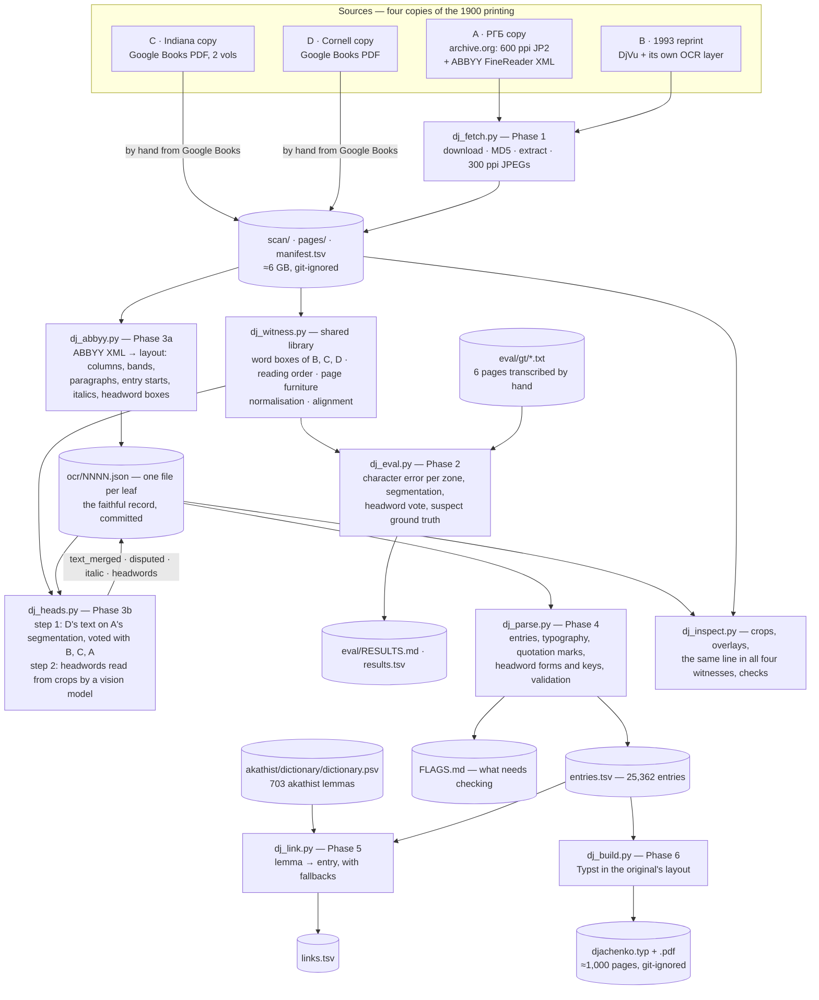

# Church Slavonic: two projects

This repository holds two separate pieces of work. They share a subject, a repository and a scripts folder, and
nothing else.

| Folder | Project |
|---|---|
| `akathist/` | **Akathist to the Theotokos before the Kazan icon** — the text and a 703-entry dictionary of it, as groundwork for a Dutch translation. Built by `tools/build.py`. |
| `djachenko/` | **A digital edition of Дьяченко's dictionary of 1900** — the whole of Г. Дьяченко's *Полный церковнославянский словарь*, 25,362 entries, made from four scanned copies. Built by `tools/dj_*.py`. |

The Дьяченко project started as a reference work for the akathist dictionary, but it is its own undertaking: it
digitises the entire book, not the part the akathist needs, and it can be read, run and used without the akathist
project. The single point of contact is `tools/dj_link.py`, which cross-references the akathist's 703 lemmas with
Дьяченко's entries (Phase 5 of its plan).

---

## 1. The akathist and its dictionary (`akathist/`)

Source: https://azbyka.ru/molitvoslov/akafist-presvjatoj-bogorodice-pred-ikonoj-kazanskaja.html
(Church Slavonic in civil script with stress marks, with a Russian rendering), retrieved 2026-09-19.

### Contents

| Path | What it is |
|---|---|
| `akathist/source/akafist-kazanskaja-cs.txt` | The Church Slavonic text, one paragraph per line, headings `## Конда́к 1.` etc. (kontakia 1–13, ikoi 1–12, the repeated ikos 1 / kontakion 1, two prayers). |
| `akathist/source/akafist-kazanskaja-ru.txt` | The Russian rendering from the same page, aligned paragraph for paragraph. |
| `akathist/dictionary/dictionary.psv` | **Master dictionary** (edit this one). 703 entries, one per line, fields separated by ` \| `: lemma · part of speech · attested forms · Russian · English · Dutch · notes. |
| `akathist/dictionary/dictionary.md` | The same, generated as readable Markdown, alphabetical, with occurrence counts per form. |
| `akathist/dictionary/forms-index.tsv` | Every word-form of the text (1070) → its lemma, so a form met while translating can be looked up directly. |
| `akathist/dictionary/dictionary.typ`, `dictionary.pdf` | The same in a conventional printed-dictionary layout (Typst source and the compiled PDF): two columns on A5, run-in entries with hanging indent, guide words in the running head, letters bookmarked in the PDF outline. |
| `tools/build.py` | Regenerates all derived files from the master and checks that every form in the source text is covered by exactly one entry: `python3 tools/build.py` (options: `--paper a4` gives three columns; `--columns`, `--size`; `--no-pdf` skips the Typst compilation). |

### How the dictionary was made

1. The Church Slavonic text was tokenised (2298 tokens, 1070 distinct forms after removing stress marks).
2. Every form was assigned to a lemma by hand; the build script verifies that nothing is missing, nothing is claimed twice
   (except the two deliberate homonyms `мир` peace/world and `о` preposition/interjection), and that no listed form is absent from the text.
3. Every lemma got a Russian, English and Dutch gloss and, where relevant, notes on the Greek term behind it, its biblical
   locus (LXX psalm numbering), the liturgical text it quotes or echoes, false friends with modern Russian, and the usual
   Dutch Orthodox rendering.

Coverage is complete: all nouns, adjectives, verbs, adverbs, participles and numerals are in, and — since they cost little
and sometimes matter (`ра́ди`, `ра́зве`, `я́ко`, `да`, `е́же`, the relative `-же` pronouns) — so are the pronouns,
prepositions, conjunctions and particles, with short glosses.

The PDF is compiled with [Typst](https://typst.app) (0.15 was used). The Typst source uses PT Serif (bundled with macOS)
for Cyrillic and Latin because it anchors the combining stress mark (U+0301) correctly on Cyrillic vowels, and falls back to
Typst's bundled Libertinus Serif for Greek. If PT Serif is not installed Typst warns and uses Libertinus throughout, which
leaves the stress marks visibly displaced to the right of their vowels; any serif font with Cyrillic mark anchoring
(Times New Roman also works) can be put first in the `font:` list of `tools/build.py`.

### Conventions

- Headwords are in civil script with the stress as printed in the source. Verbs are given under the infinitive
  (`вопи́ти`), participles under their verb, nouns in nom. sg., adjectives in the long masculine form (`благи́й`),
  fixed epithets of the Theotokos capitalised as in the source (`Пречи́стый`, `Засту́пница`).
- Glosses separated by `;` are alternatives, most literal / most usual first. Russian glosses give the modern
  Russian equivalent(s) of the *lemma*, which is not always the word the page's Russian rendering uses in context.
- Dutch glosses lean on Dutch Orthodox liturgical usage where a fixed term exists (`Moeder Gods`, `Alheilige`,
  `Alreine`, `Verheug u`, `ontferming`, `in de eeuwen der eeuwen`, `eerbiedwaardiger dan de Cherubijnen`) and on the Dutch Bible
  tradition for Gospel quotations (Luke 1:28, 30, 38, 42, 48).

### Church Slavonic words that are not what they look like in Russian

The notes flag these individually; the ones a translator most needs to have in mind:

| CS | means | not |
|---|---|---|
| воня́ | fragrance, sweet smell (2 Cor 2:16) | stench |
| живо́т | life | belly |
| лесть | deceit, delusion, error (Mt 27:64) | flattery |
| напра́сный | sudden (of death) | vain, futile |
| находи́ти (находящих зол) | to come upon, befall | to find |
| призре́ние | gracious care, looking-after | contempt |
| изве́стный | sure, certain, reliable | famous |
| живо́тный | of life, life-giving | animal |
| честны́й | honoured, precious, venerable | honest |
| стра́стный | of the passions (πάθη) | passionate (romantic) |
| те́плый | fervent, ardent | lukewarm |
| горе́ (adv.) | on high, above | woe |
| любе́зно | lovingly | politely |
| забра́ло | rampart, bulwark | visor |
| пала́та | palace | ward, chamber |
| весь (noun) | village | — (homonym of *весь* "all") |
| лик / лице́ | choir, company / face | — (two different nouns) |
| у́м / ра́зум / смысл | νοῦς / γνῶσις-σύνεσις / φρόνημα | — (three words, keep them apart) |

### Passages that quote or echo other texts

Worth deciding once, then keeping identical wherever they recur:

- **Refrain** (×15): `Ра́дуйся, Засту́пнице усе́рдная ро́да христиа́нскаго` — from the Kazan troparion (tone 4).
  The first six lines of Ikos 4 paraphrase the rest of that troparion (`Ма́ти Бо́га Вы́шняго … в держа́вный Тво́й покро́в прибега́ющим`).
- **Luke 1** in Ikos 9: `Благода́тная`, `Госпо́дь с Тобо́ю` (1:28), `Благослове́нная в жена́х` (1:42), `обре́тшая благода́ть у Бо́га` (1:30),
  `осене́нная си́лою Всевы́шняго` (1:35), `ве́рная Рабо́ Госпо́дня` (1:38), `блажа́т вси́ ро́ди` (1:48); in Prayer 1 `сокруше́нным се́рдцем` (Ps 50:19 LXX).
- **Great Akathist** (Ἀκάθιστος): Ikos 1 (`А́нгел предста́тель по́слан бы́сть рещи́…`), Ikos 2 (`Разуме́ние … и́щущи`; `неве́рных сумни́тельное слы́шание / ве́рных изве́стная похвало́`),
  Kontakion 3 (`Си́ла Вы́шняго`), Kontakion 5 (`Боготе́чная звезда́`), Ikos 6 (`Возсия́вши просвеще́ние и́стинное и отгна́вши … ле́сть`), Kontakion 8 (`Стра́нно … неве́рующим слу́шати`),
  Ikos 8 (`Невмести́маго вмести́лище`), Kontakion 9 (`Вся́каго естества́ а́нгельскаго превы́шшая`), Ikos 9 (`Вити́я многовеща́нныя, я́ко ры́бы безгла́сныя`),
  Kontakion 10 (`Спасти́ хотя́щи`), Ikos 10 (`Стена́ еси́`), Ikos 11 (`светоприе́мную свещу́ … невеще́ственный о́гнь … наставля́ющи`), Kontakion 12 (`Благода́ть да́ти восхоте́вши`),
  Ikos 12 (`Пою́ще … хва́лим Тя́`), Kontakion 13 (`О Всепе́тая Ма́ти, ро́ждшая все́х святы́х Святе́йшее Сло́во, приими́ ны́не ма́лое сие́ моле́ние`), and the refrain `Неве́сто Неневе́стная` (Ikos 11).
- **Theophany canon, 9th-ode irmos** (`Недоуме́ет вся́к язы́к благохвали́ти по достоя́нию, изумева́ет же у́м … пе́ти Тя́ … оба́че, Блага́я су́щи…`) in Ikos 9.
- **Hymn to the Theotokos** `Честне́йшую Херуви́м и Сла́внейшую без сравне́ния Серафи́м` in Kontakion 9.
- **Kontakion "Предста́тельство христиа́н непосты́дное, хода́тайство ко Творцу́ непрело́жное"** behind `христиа́н непосты́дное упова́ние` (Ikos 12) and `хода́тайству Твоему́` (Prayer 2).
- **Vespers/Compline prayer** `Не и́мамы ины́я по́мощи, не и́мамы ины́я наде́жды, ра́зве Тебе́` in both prayers.
- **Icon titles**: `все́х скорбя́щих Ра́досте` (Ikos 3), `Живоно́сный Исто́чник` (Ikos 12), `Одиги́трия / Путеводи́тельница` (Ikos 7, Ikos 5), `Держа́вный покро́в`.
- **St Basil / Nicaea II**: `че́сть бо ико́ны на первообра́зное восхо́дит` (Kontakion 8).
- **Doxologies**: `Пречестно́е и Великоле́пое И́мя Отца́ и Сы́на и Свята́го Ду́ха`, `ны́не и при́сно и во ве́ки веко́в`, `Тебе́ сла́ва подоба́ет`.

### References

The glosses and notes were written from the compiler's knowledge of the texts, not by systematic look-up; these are the
standard works against which entries should be checked.

**Church Slavonic**
- Г. Дьяченко, *Полный церковнославянский словарь* (Москва, 1900) — the classic one-volume dictionary, still the first
  place to look. Only page scans of it exist online; the digital edition being made from them is the second project in
  this repository, [below](#2-a-digital-edition-of-дьяченко-1900-djachenko).
- *Большой словарь церковнославянского языка Нового времени* (Институт русского языка РАН, Москва, 2016–; in progress,
  alphabetically from А) — the modern scholarly dictionary of the Slavonic of the printed service books, with citations.
- А. Бончев, *Речник на църковнославянския език* (София, 2002–2012), 2 vols — useful second opinion.

**Russian** (for the Russian column)
- С. И. Ожегов, Н. Ю. Шведова, *Толковый словарь русского языка* (the desk dictionary of normative Russian; Ожегов's own
  *Словарь русского языка* first appeared in 1949).
- Д. Н. Ушаков (ed.), *Толковый словарь русского языка*, 4 vols (Москва, 1935–1940) — older, fuller on literary and
  church-flavoured vocabulary.
- Both are searchable at gramota.ru.

**Greek** (for the Greek terms cited in the notes)
- G. W. H. Lampe, *A Patristic Greek Lexicon* (Oxford, 1961) — patristic and liturgical vocabulary.
- Liddell–Scott–Jones, *A Greek–English Lexicon* (LSJ) and Bauer–Danker (BDAG), *A Greek-English Lexicon of the New
  Testament* — classical and New Testament usage.
- The Greek text of the Akathist (Ἀκάθιστος Ὕμνος) for the passages the Kazan akathist paraphrases.

**Scripture**
- Septuagint (Rahlfs–Hanhart) for Old Testament references; Psalm numbering in this dictionary follows the LXX.
- The Elizabeth Bible (Елизаветинская Библия, 1751) for the Church Slavonic wording of quotations.

**Dutch**
- Dutch Orthodox service books for fixed liturgical terms — in particular the translations of the Liturgy of St John
  Chrysostom and of the Akathist hymn in use in the Netherlands and Flanders, which are the source of renderings such as
  *Moeder Gods*, *Alheilige*, *Verheug u*, *in de eeuwen der eeuwen*.
- For Gospel quotations (Luke 1) the Willibrordvertaling and NBG 1951 / NBV21 are cited where their wording matters.

---

## 2. A digital edition of Дьяченко (1900) (`djachenko/`)

Прот. Григорий Дьяченко, *Полный церковно-славянскій словарь (со внесеніемъ въ него важнѣйшихъ древне-русскихъ словъ
и выраженій)*, Москва: Типографія Вильде, 1900 — XXXVIII + 1,120 pages in two columns, about 30,000 entries. It is
still the first place to look up a Church Slavonic word, and it is in the public domain (author †1903). Scans of it
are everywhere; **a transcribed edition does not exist**. This project makes one: a structured, machine-readable
`entries.tsv`, and from it a rendition set like the original.

The text is not taken from one scan. Four copies of the 1900 printing — "witnesses", recorded with everything that
was checked about them in `COPIES.md` — were located, and their OCR layers were scored against six pages transcribed
by hand (`eval/`). Each kind of content then comes from whichever witness reads it best, and the rest is voted
character by character:

| | Physical copy | Scan | What it contributes |
|---|---|---|---|
| **A** | Russian State Library | archive.org, colour 600 ppi JP2, with archive.org's ABBYY FineReader layer | the **page geometry**: columns, bands, paragraphs, entry starts, italics, headword boxes. Its left margin is cut off on 242 pages and its right margin on 313 |
| **B** | the copy reproduced in the 1993 reprint | archive.org DjVu, ≈237 ppi, with its own OCR | second opinion in the vote |
| **C** | Indiana University (a photo-offset reprint) | Google Books PDF, 600 ppi, 2 vols | third opinion |
| **D** | Cornell University (an original of 1900) | Google Books PDF, 600 ppi | the **primary text**: 1.5 % character error against the ground truth, and it has the margins and the Greek that A lost |

Measured on the six ground-truth pages (`eval/RESULTS.md`): definition text ≈1 % character error after the vote,
Greek 1.5 %, entry segmentation 99 % recall and 100 % precision on ordinary pages. The Church Slavonic headwords are
the one thing no OCR reads (about 48 % exact in every layer), so they are read from 400 ppi crops of the page images
by a vision model — the step still outstanding.

### The toolchain



`dj_witness.py` is a library, not a command; every other script is run directly and is idempotent and resumable, so
an interrupted run can simply be repeated. What each of them does in detail is in its own docstring.

| Script | Phase | Output |
|---|---|---|
| `tools/dj_fetch.py` | 1 | `scan/` (MD5-verified originals), `pages/` (600 ppi JP2 + 300 ppi JPEG), `manifest.tsv` |
| `tools/dj_abbyy.py` | 3a | `ocr/NNNN.json`: the page's layout and ABBYY's reading |
| `tools/dj_witness.py` | — | shared access to B, C, D and the text machinery (used by 3b and 2) |
| `tools/dj_heads.py` | 3b | the merged text and the headwords, written back into `ocr/NNNN.json` |
| `tools/dj_eval.py` | 2 | `eval/results.tsv`; the numbers behind every routing decision |
| `tools/dj_parse.py` | 4 | `entries.tsv`, `FLAGS.md` |
| `tools/dj_link.py` | 5 | `links.tsv` (akathist lemmas → entries) |
| `tools/dj_build.py` | 6 | `djachenko.typ`, `djachenko.pdf` |
| `tools/dj_inspect.py` | — | page crops and overlays in `inspect/`, for checking by eye |

### Where it stands

- **Text:** merged for all 1,119 dictionary pages; 25,362 entries (20,079 in the main sequence, 5,283 in the
  supplement) in `entries.tsv`, with the spans where the witnesses disagree and the italics marked per entry.
- **Headwords:** 25 read so far; the other 25,337 carry witness D's provisional reading and are printed grey in the
  PDF. Reading them is the next step.
- **Cross-reference:** 243 of the 703 akathist lemmas are linked — a lower bound until the headwords are read.
- **Rendition:** the whole book in the original's layout, about 1,000 A4 pages.
- **Proofreading:** not started. `FLAGS.md` lists what to look at first.

### Documentation

`djachenko/` documents itself, so that a session months later can pick the work up:

| File | What it holds |
|---|---|
| `PROGRESS.md` | the running log; **its `NEXT:` line is where to start** |
| `PLAN.md` | the phases, each with a definition of done and a resume paragraph |
| `SOURCE.md` | the scan in use: URLs, checksums, leaf → printed page, scan defects |
| `COPIES.md` | every copy or scan located, including those that could not be downloaded |
| `eval/RESULTS.md` | the Phase 2 measurements and the route they decided |
| `FLAGS.md` | the validation report of the last `dj_parse.py` run |
| `QUOTES.md` | a worked example of one defect (floating quotation marks): measurement, rules, verification |

### Rebuilding it

The scans (≈6 GB) and the generated PDF are not in the repository; everything else is.

```sh
python3 tools/dj_fetch.py --all     # witness A and the OCR layers, resumable (witnesses C and D by hand)
python3 tools/dj_abbyy.py           # Phase 3a: layout → ocr/*.json          (~6 s)
python3 tools/dj_heads.py text      # Phase 3b step 1: the merged text       (~80 s)
python3 tools/dj_parse.py           # Phase 4: entries.tsv + FLAGS.md        (~3 s)
python3 tools/dj_link.py            # Phase 5: links.tsv
python3 tools/dj_build.py           # Phase 6: djachenko.typ + .pdf          (~4 min)
python3 tools/dj_eval.py --refresh  # Phase 2: re-score everything against eval/gt/
```

Requirements: Python 3 with `numpy` and `Pillow`, the `pdftotext`/`pdftoppm` (poppler) and `djvused`/`ddjvu`
(DjVuLibre) command-line tools for the witnesses, and [Typst](https://typst.app) for the PDF. The two fonts of the
rendition (Ponomar Unicode for Church Slavonic, Old Standard TT for the civil text and Greek) are fetched by
`dj_build.py`; both are under the SIL Open Font License.
